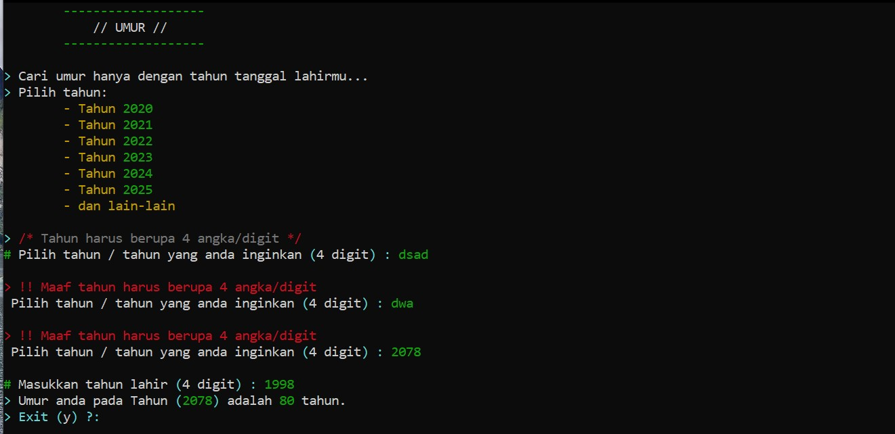

# Kalkulator-Umur
Kalkulator Umur merupakan kalkulator yang bisa menghitung umur melalui tahun berapa yang di inginkan




# Run
Windows :
> Download ZIP > Ekstrak > Buka "umur.exe"

Linux :
```bash
$ git clone https://github.com/d4v-id/Kalkulator-Umur/
$ sudo apt-get install build-essentsial
$ cd Kalkulator-Umur
$ gcc –v
$ sudo gcc umur.cpp ATAU sudo gcc -o umur umur.cpp
$ sudo g++ umur.cpp
```
Termux :
```bash
$ git clone https://github.com/d4v-id/Kalkulator-Umur/
$ pkg install clang
$ clang++ umur.cpp
$ ./a.out
```

# Support / Contact
// https://saweria.co/vedd (Donasi)

// d4vbusiness@gmail.com (Gmail)
